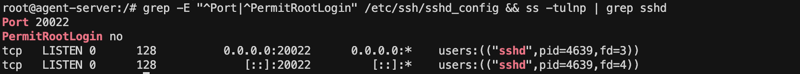
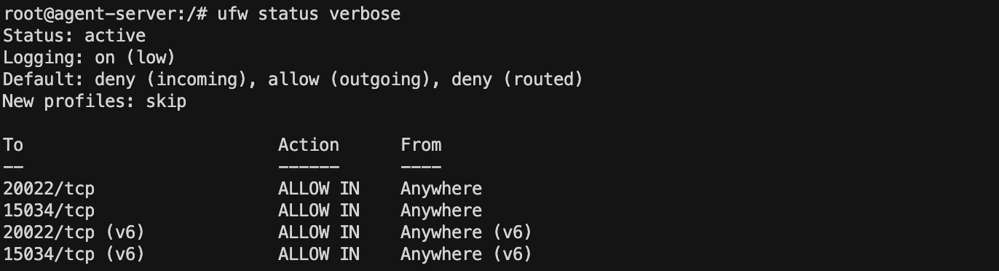
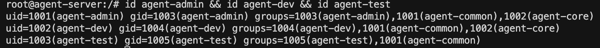
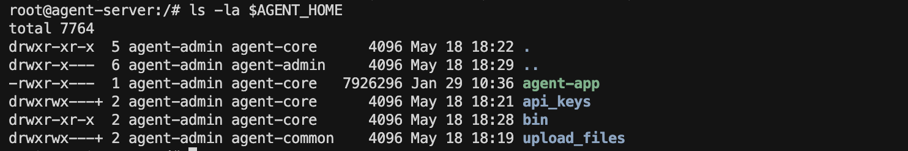
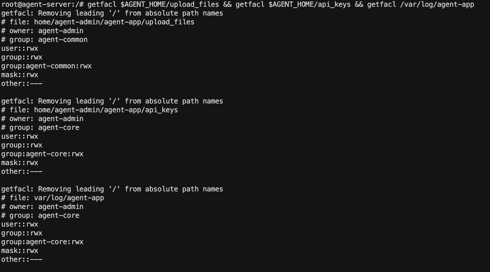

# 요구사항 수행 내역서
## 시스템 관제 자동화 스크립트 개발 (B1-1)

- **작성일:** 2026-05-14
- **환경:** Docker Ubuntu 24.04 (linux/amd64), 컨테이너명: `codyssey-b1-1`

---

## 필수 증거 자료 체크리스트

- [x] SSH 포트 변경(20022) 및 Root 원격 접속 차단 설정 확인
- [x] 방화벽(UFW) 활성화 및 20022/tcp, 15034/tcp만 허용 확인
- [x] 계정/그룹(agent-admin/dev/test, agent-common/core) 생성 확인
- [x] 디렉토리 구조 및 권한(ACL 포함) 확인
- [x] 앱 Boot Sequence 5단계 [OK] 및 "Agent READY" 확인
- [x] monitor.sh 실행 결과(프로세스/포트/리소스/경고) 확인
- [x] /var/log/agent-app/monitor.log 누적 기록 확인
- [x] crontab 매분 실행 등록 및 자동 실행 확인(1분 후 로그 증가)

---

## 1. 기본 보안 및 네트워크 설정

### 1-1. SSH 설정

**적용 명령어**
```bash
sed -i 's/#Port 22/Port 20022/' /etc/ssh/sshd_config
sed -i 's/#PermitRootLogin prohibit-password/PermitRootLogin no/' /etc/ssh/sshd_config
mkdir -p /run/sshd
service ssh start
```

**설정 확인 (`/etc/ssh/sshd_config`)**
```
Port 20022
PermitRootLogin no
```

**포트 리슨 상태 (`ss -tulnp | grep sshd`)**
```
tcp  LISTEN  0  128  0.0.0.0:20022  0.0.0.0:*  users:(("sshd",pid=4626,fd=3))
tcp  LISTEN  0  128     [::]:20022     [::]:*  users:(("sshd",pid=4626,fd=4))
```



---

### 1-2. 방화벽 설정 (UFW)

**적용 명령어**
```bash
ufw default deny incoming
ufw default allow outgoing
ufw allow 20022/tcp
ufw allow 15034/tcp
ufw --force enable
```

**방화벽 상태 (`ufw status verbose`)**
```
Status: active
Default: deny (incoming), allow (outgoing), deny (routed)

To                         Action      From
--                         ------      ----
20022/tcp                  ALLOW IN    Anywhere
15034/tcp                  ALLOW IN    Anywhere
20022/tcp (v6)             ALLOW IN    Anywhere (v6)
15034/tcp (v6)             ALLOW IN    Anywhere (v6)
```



---

## 2. 계정/그룹/권한 체계

### 2-1. 계정 및 그룹 생성

**적용 명령어**
```bash
groupadd agent-common
groupadd agent-core
useradd -m -s /bin/bash -G agent-common,agent-core agent-admin
useradd -m -s /bin/bash -G agent-common,agent-core agent-dev
useradd -m -s /bin/bash -G agent-common agent-test
```

**계정 확인 (`id` 명령어)**
```
uid=1001(agent-admin) gid=1003(agent-admin) groups=1003(agent-admin),1001(agent-common),1002(agent-core)
uid=1002(agent-dev)   gid=1004(agent-dev)   groups=1004(agent-dev),1001(agent-common),1002(agent-core)
uid=1003(agent-test)  gid=1005(agent-test)  groups=1005(agent-test),1001(agent-common)
```



---

### 2-2. 디렉토리 구조 및 권한

**적용 명령어**
```bash
AGENT_HOME=/home/agent-admin/agent-app
mkdir -p $AGENT_HOME/upload_files $AGENT_HOME/api_keys $AGENT_HOME/bin
mkdir -p /var/log/agent-app

chown agent-admin:agent-core   $AGENT_HOME
chown agent-admin:agent-core   $AGENT_HOME/bin
chown agent-admin:agent-common $AGENT_HOME/upload_files && chmod 770 $AGENT_HOME/upload_files
chown agent-admin:agent-core   $AGENT_HOME/api_keys    && chmod 770 $AGENT_HOME/api_keys
chown agent-admin:agent-core   /var/log/agent-app      && chmod 770 /var/log/agent-app

setfacl -m g:agent-common:rwx $AGENT_HOME/upload_files
setfacl -m g:agent-core:rwx   $AGENT_HOME/api_keys
setfacl -m g:agent-core:rwx   /var/log/agent-app
```

**디렉토리 권한 확인 (`ls -la $AGENT_HOME`)**
```
drwxr-xr-x  agent-admin  agent-core   agent-app/
drwxrwx---+ agent-admin  agent-core   api_keys/
drwxr-xr-x  agent-admin  agent-core   bin/
drwxrwx---+ agent-admin  agent-common upload_files/
```



**ACL 확인 (`getfacl`)**

`upload_files`:
```
# owner: agent-admin / group: agent-common
user::rwx
group::rwx
group:agent-common:rwx
other::---
```

`api_keys` / `/var/log/agent-app`:
```
# owner: agent-admin / group: agent-core
user::rwx
group::rwx
group:agent-core:rwx
other::---
```



---

## 3. 애플리케이션 실행 환경

### 3-1. 환경 변수 (`/home/agent-admin/.bashrc`)

```bash
export AGENT_HOME=/home/agent-admin/agent-app
export AGENT_PORT=15034
export AGENT_UPLOAD_DIR=$AGENT_HOME/upload_files
export AGENT_KEY_PATH=$AGENT_HOME/api_keys/t_secret.key
export AGENT_LOG_DIR=/var/log/agent-app
```

### 3-2. 키 파일

```bash
# 경로: $AGENT_HOME/api_keys/t_secret.key
# 내용: agent_api_key_test
# 권한: -rw-r----- agent-admin:agent-core (640)
echo 'agent_api_key_test' > $AGENT_HOME/api_keys/t_secret.key
chmod 640 $AGENT_HOME/api_keys/t_secret.key
```

### 3-3. Boot Sequence 확인

`agent-admin` 계정으로 실행:
```
>>> Starting Agent Boot Sequence...
[1/5] Checking User Account               [OK]
 ... Running as service user 'agent-admin' (uid=1001)
[2/5] Verifying Environment Variables     [OK]
 ... All required Envs correct
[3/5] Checking Required Files             [OK]
 ... Verified 'secret.key' with correct key string.
[4/5] Checking Port Availability          [OK]
 ... Port 15034 is available.
[5/5] Verifying Log Permission            [OK]
 ... Log directory is writable: /var/log/agent-app
------------------------------------------------------------
All Boot Checks Passed!
Agent READY
```

**포트 리슨 확인 (`ss -tlnp | grep 15034`)**
```
LISTEN  0  1  0.0.0.0:15034  0.0.0.0:*  users:(("agent-app",pid=4863,fd=19))
```


---

## 4. monitor.sh 실행 결과

### 4-1. 스크립트 권한

```
-rwxr-x---  agent-dev  agent-core  $AGENT_HOME/bin/monitor.sh  (750)
```


### 4-2. 콘솔 출력 (`monitor.sh` 수동 실행)

```
====== SYSTEM MONITOR RESULT ======

[HEALTH CHECK]
Checking process 'agent-app'... [OK] (PID: 4863)
Checking port 15034... [OK]

[RESOURCE MONITORING]
CPU Usage : 1%
MEM Usage : 11.7%
DISK Used  : 2%

[WARNING] MEM threshold exceeded (11.7% > 10%)

[INFO] Log appended: /var/log/agent-app/monitor.log
======================================
```


---

## 5. crontab 자동 실행

### 5-1. crontab 등록 (`agent-admin` 계정)

```bash
* * * * * AGENT_HOME=/home/agent-admin/agent-app AGENT_PORT=15034 AGENT_LOG_DIR=/var/log/agent-app bash /home/agent-admin/agent-app/bin/monitor.sh >> /var/log/agent-app/cron.log 2>&1
```


### 5-2. monitor.log 자동 누적 확인

```
[2026-05-14 06:18:56] PID:4863 CPU:1% MEM:11.7% DISK_USED:2%
[2026-05-14 06:30:01] PID:4863 CPU:1% MEM:12.0% DISK_USED:2%
[2026-05-14 06:31:02] PID:4863 CPU:0% MEM:12.0% DISK_USED:2%
[2026-05-14 06:32:02] PID:4863 CPU:0% MEM:12.1% DISK_USED:2%
[2026-05-14 06:33:01] PID:4863 CPU:0% MEM:11.9% DISK_USED:2%
[2026-05-14 06:34:02] PID:4863 CPU:1% MEM:11.9% DISK_USED:2%
[2026-05-14 06:35:02] PID:4863 CPU:0% MEM:12.0% DISK_USED:2%
[2026-05-14 06:36:01] PID:4863 CPU:0% MEM:12.2% DISK_USED:2%
```

→ 매분 자동으로 새 라인이 누적됨을 확인.


---

---

## 6. 보너스 과제

### 6-1. report.sh — 통계 리포트 자동 생성

**파일 위치:** `$AGENT_HOME/bin/report.sh` (권한: 750, 소유: agent-dev:agent-core)

**기능**
- `monitor.log`를 분석해 CPU/MEM/DISK의 평균·최대·최소·샘플수를 콘솔 출력
- `-s 'YYYY-MM-DD HH:MM:SS'` / `-e 'YYYY-MM-DD HH:MM:SS'` 옵션으로 구간 필터 지원

**전체 로그 분석 실행 결과**
```
====== STATISTICS REPORT ======

  [CPU]
    Average : 0.4%
    Maximum : 1.0% at 2026-05-14 06:18:56
    Minimum : 0.0% at 2026-05-14 06:31:02
  [Memory]
    Average : 12.0%
    Maximum : 12.2% at 2026-05-14 06:36:01
    Minimum : 11.7% at 2026-05-14 06:18:56
  [Disk]
    Average : 2.0%
    Maximum : 2.0% at 2026-05-14 06:18:56
    Minimum : 2.0% at 2026-05-14 06:18:56
  [Samples]
    Data Points: 10 samples

==============================
```


**구간 필터 실행 예시**
```bash
bash report.sh -s '2026-05-14 06:30:00' -e '2026-05-14 06:33:59'
```
```
====== STATISTICS REPORT ======
  From : 2026-05-14 06:30:00
  To   : 2026-05-14 06:33:59

  [CPU]
    Average : 0.2%
    Maximum : 1.0% at 2026-05-14 06:30:01
    Minimum : 0.0% at 2026-05-14 06:31:02
  [Memory]
    Average : 12.0%
    Maximum : 12.1% at 2026-05-14 06:32:02
    Minimum : 11.9% at 2026-05-14 06:33:01
  [Disk]
    Average : 2.0%
    Maximum : 2.0% at 2026-05-14 06:30:01
    Minimum : 2.0% at 2026-05-14 06:30:01
  [Samples]
    Data Points: 4 samples

==============================
```


---

### 6-2. archive.sh — 시간 기반 로그 보존 정책

**파일 위치:** `$AGENT_HOME/bin/archive.sh` (권한: 750, 소유: agent-dev:agent-core)

**정책**

| 단계 | 대상 | 동작 |
|------|------|------|
| 압축 | `/var/log/agent-app/*.log` 중 7일 이상 경과 | `.gz` 압축 |
| 이동 | 압축된 파일 | `/var/log/monitor/agent-app/archive/` 로 이동 |
| 삭제 | `archive/*.gz` 중 30일 이상 경과 | 삭제 |

**예외 처리 항목**
- 아카이브 디렉토리 미존재 시 자동 생성, 생성 실패 시 `exit 1`
- 쓰기 권한 부족 시 `[ERROR]` 출력 후 `exit 1`
- 읽기/삭제 권한 부족 파일은 `[WARNING]` 출력 후 건너뜀
- 대상 파일 0개인 경우 `(건너뜀)` 안내 후 정상 종료

**실행 결과**
```
====== LOG ARCHIVE PROCESS ======

[INFO]    Step 1: 7일 경과 로그 파일 압축 및 아카이브 이동
[INFO]    압축 완료: old_test.log → /var/log/monitor/agent-app/archive/old_test.log.gz
[INFO]    압축 완료: 1개 / 실패: 0개

[INFO]    Step 2: 30일 경과 아카이브 파일 삭제
[INFO]    30일 경과 아카이브 파일 없음 (건너뜀)

[INFO]    아카이브 처리 완료
==================================
```


---

## 7. 제출 파일 목록

| 파일 | 설명 |
|------|------|
| `수행내역서.md` | 본 문서 |
| `monitor.sh` | 시스템 상태 수집 및 로깅 스크립트 |
| `report.sh` | monitor.log 통계 분석 스크립트 (보너스 1) |
| `archive.sh` | 로그 압축/아카이브/삭제 스크립트 (보너스 2) |
